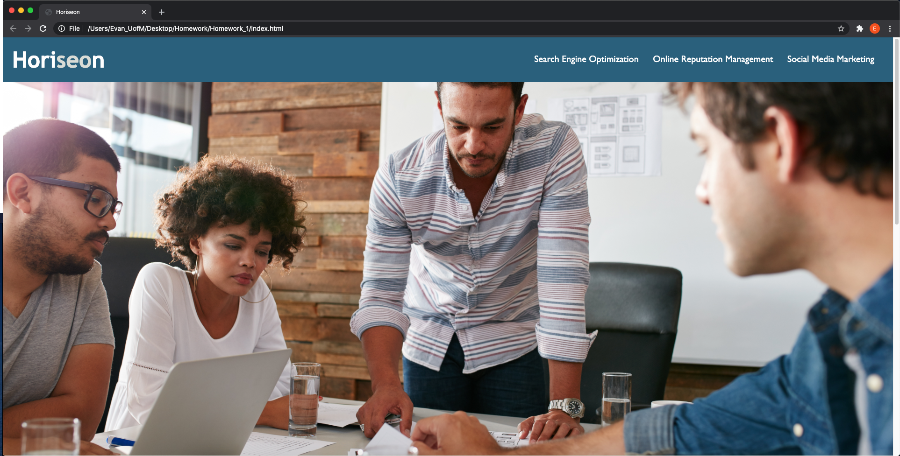
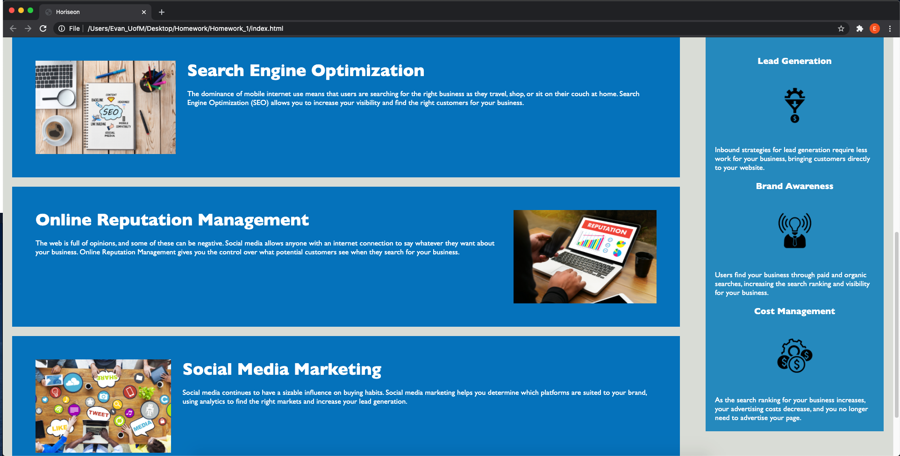

# Homework_1
## Description:
-Changed "div" tags to semantic tags
 
-Added missing alt tags to images
 
-Fixed search-engine-optimization navigation link
 
-Combined redundant CSS classes
 

## Screenshots:

## Links:
https://github.com/evanjamesc/Homework_1
 
https://evanjamesc.github.io/Homework_1/

## Notes:
-I'm still a bit unsure about what should be in a README file, I hope this is correct.